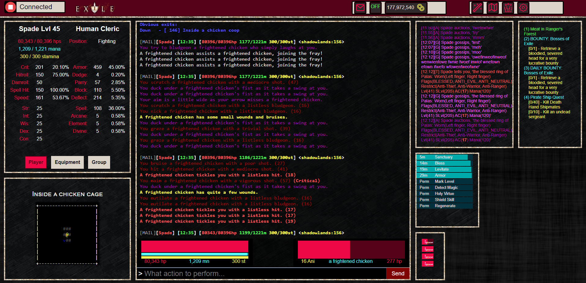

# Ranvier Web Client

## About

This web client is designed to be used with [Ranvier](https://ranviermud.com/) and connects to a running Ranvier Mud via websockets. It is designed to be the main player interface as they interact with the game.

Ranvier has it's own client, [Nuero](https://github.com/RanvierMUD/neuro) that works out of the box with a base Ranvier repo. Nuero is built with polymer to support desktop apps as well as web apps.

This client is built with React/Redux and uses SocketIO to connect as a websocket connection to the Ranvier backend. Any use will require customization on the backend and the client as my game is not your game.

Ideally, you can use this repo as inspiration or a base to modify to suit your MUD that you want to create.



## About Ranvier

- To Download Ranvier, see it's [github](https://github.com/RanvierMUD).
- To see Ranvier's 'Getting Started' see [here](https://ranviermud.com/get_started/).
- Questions about this app or Ranvier, join us on slack: https://ranviermud.slack.com/

In the project directory, you can run:

## Installation

Simple installation of cloning, installing packages, then running the program.

```bash
  git clone https://github.com/nelsonsbrian/exile-client
  cd 'exile-client'
  npm install
  npm start
```

By default the connection is pointed at `http://localhost:4001/` and can be modified in the `SocketManager.js` file component. This matches the websocket port of Ranvier by default.

## Technologies Used
* RanvierMud library
* ReactJS
* Javascript
* SocketIO
* Redux

## Customization

Like all websockets, how you structure the messages back and forth is up to the implementor. How this project is setup by default:

## Regular Messages

Server Send:
``` javascript
this.socket.emit("message", { type: "message", message })
```

Client Receive:
``` javascript
this.socket.on("message", (payload) => {...}
```

## Extra Data

Server Send:
``` javascript
this.socket.emit("data", { type: "data", group, data })
```
`group` is a subtype of data such as:

`this.socket.command('sendData', 'quests', { ... //data to be sent});`

Client Receive:
``` javascript
this.socket.on("data", (payload) => {...}
```

## Data Storage
How the data that is displayed on the client is displayed is with a Redux store. As the client receives `data` packets from the server, that data is stored directly in the store to be used later.

## License
The MIT License (MIT)